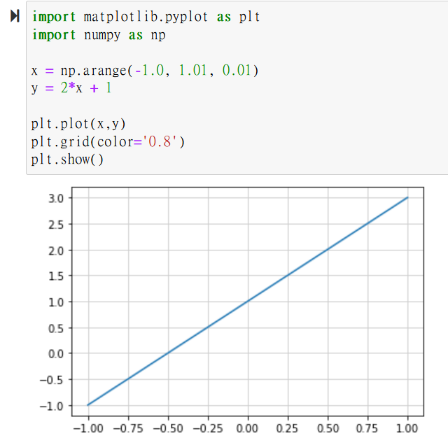

# 用方程式描繪圖形

## 程式與 Python

### 學會使用 **matplotlib**

#### 添加 **matplotlib 函式到程式**

```
import matplotlib.pyplot as plt
```

**繪圖**

```
# 給定資料
x = [ 1, 2, 3, 4, 5, 6, 7]
y = [ 50, 44.7, 51.2, 66, 49.1, 47, 50.5]

# 描繪折線
plt.plot(x,y)
```

.png>)

```
# 描繪格線
plt.grid(color='0.8')
```

.png>)

## 數學

### 方程式

包含文字的等式。

有些簡化的寫法需要注意，例如：乘法的表示。

### 函數

是一種關係的表達。當你決定一個輸入的值x 時，就等於決定了一個輸出的值y 。

例如：\
&#x20;y = 2x + 1\
&#x20;y = x^2 + 4

### 函數與圖

```
import matplotlib.pyplot as plt
import numpy as np

x = np.arange(-1.0, 1.01, 0.01)
y = 2*x + 1

plt.plot(x,y)
plt.grid(color='0.8')
plt.show()
```



### 直線的方程式

#### 解聯立

//

#### 兩條正交的直線

//

#### 兩條直線的交點

//

### 比例式與三角比

#### 比例式的形式

//

#### 將線段內分為 m:n 的點

//

### 三角比與圓

#### 相似三角形

//

#### 三角形的邊的關係->三角函數

//

#### 利用三角比畫圓

//

#### 三角比與角度

//

### 畢氏定理

#### 圓的方程式

//

#### 2點間的距離

//

### 其他幾何

#### 點到直線的距離

//
